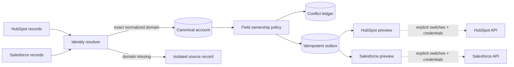

# RevOps Sync Control Plane

An auditable control plane for reconciling HubSpot and Salesforce account data without hiding identity decisions or pretending that a preview is a successful CRM sync.

The system normalizes exact domains, creates a canonical account, applies disclosed field-ownership policies, records every cross-CRM disagreement, and generates idempotent outbox payloads. Live writes are disabled by default and no delivery endpoint is exposed.

> The committed CRM fixture is entirely synthetic. This repository demonstrates software behavior—not customer data, campaign performance, pipeline, or revenue impact.

## Why this project exists

Naive two-way CRM syncs create loops and overwrite good data with stale data. The difficult parts are not HTTP requests; they are identity, ownership, replay safety, auditability, and knowing when **not** to merge.

This project makes those decisions inspectable:



## What is implemented

- conservative identity resolution using normalized exact domains
- explicit refusal to fuzzy-merge same-name records when a domain is unavailable, or to merge on a generic mail/website-builder domain (`gmail.com`, `shopify.com`, ...) at all
- refusal to stage a cross-provider create for an account with no stable identity anchor, so a delivered write can't echo back and spawn an unbounded chain of duplicate creates in both systems
- an explicit re-identification path: a source system echoing back a record stamped with this control plane's own canonical id rebinds to the existing account instead of isolating a new one
- deterministic canonical IDs and source-record checksums
- field ownership with preferred-source and latest-non-null fallback policies, with a fail-safe override on marketing consent specifically (a disagreement always resolves to the opt-out)
- immutable conflict fingerprints, including both source values and the chosen resolution
- transactional reconciliation in PostgreSQL or SQLite — Postgres exercised by a real, evidence-committed test run, not only by schema migration
- idempotent HubSpot and Salesforce outbox previews, keyed by a monotonic per-account-per-provider sequence so a value that reverts to an earlier state still stages a fresh preview instead of silently colliding with an old one
- guarded delivery with bounded 429/pre-connection retries, `Retry-After` support, and read-back reconciliation after ambiguous transport/5xx outcomes
- durable pre-dispatch markers and acknowledgements; sequential replay of an acknowledged or uncertain item does not issue another write
- database-backed, expiring worker claims with token-fenced transitions; only one claim-aware worker can dispatch the same item, and expired-claim takeover is read-back only
- FastAPI endpoints, optional API-key protection, OpenAPI, health/readiness, JSON logs, and Prometheus metrics
- Alembic migration, Docker Compose, GitHub Actions, and an 80% coverage gate
- a credential-ready BigQuery/dbt/Terraform path that is explicitly **not** represented as deployed

## Reproducible local run

Python 3.12+ is required.

```bash
python -m venv .venv
source .venv/bin/activate
python -m pip install -e ".[dev]"
cp .env.example .env
DATABASE_URL=sqlite:///./revops_sync.sqlite3 AUTO_CREATE_SCHEMA=true revops-sync reconcile
```

Start the API:

```bash
DATABASE_URL=sqlite:///./revops_sync.sqlite3 AUTO_CREATE_SCHEMA=true revops-sync serve
```

Then run reconciliation:

```bash
curl -s -X POST http://localhost:8000/v1/reconcile \
  -H 'content-type: application/json' \
  -d '{"source_mode":"fixture"}'
```

Inspect the canonical accounts and intended CRM actions:

```bash
curl -s http://localhost:8000/v1/accounts
curl -s http://localhost:8000/v1/outbox
```

For PostgreSQL and the containerized API:

```bash
docker compose up --build
```

## Identity policy

The automatic match rule is deliberately narrow:

1. remove scheme, path, port, trailing dot, and a leading `www.`;
2. lowercase the hostname;
3. reject the domain if it's a known mail provider or website-builder host (`gmail.com`, `shopify.com`, `wixsite.com`, ...) — a shared domain like that is not a merge key;
4. merge only on an exact normalized domain that survives step 3;
5. when no valid domain exists, isolate by `provider + external_id` — unless the record carries this control plane's own canonical id, echoed back by a source system that already received it, in which case it rebinds to that existing account instead.

Two records named “Northstar Labs” with no domain therefore remain two canonical accounts, and neither one stages a write into the provider it isn't in — an unbounded chain of duplicate creates is the failure mode that not-merging alone doesn't prevent (see "Failure mode demonstrated" in the [case study](docs/CASE_STUDY.md)). A human-reviewed merge workflow could be added later; the demo will not manufacture certainty.

## Field ownership

| Canonical field | Preferred source | Fallback |
|---|---|---|
| name | Salesforce | newest non-null observation |
| industry | Salesforce | newest non-null observation |
| employee count | Salesforce | newest non-null observation |
| account owner email | Salesforce | newest non-null observation |
| lifecycle stage | HubSpot | newest non-null observation |
| marketing opt-in | HubSpot, **except**: on disagreement the restrictive (opt-out) value always wins | newest non-null observation |

Every divergent non-null pair is still written to the conflict ledger even when policy resolves it automatically. "Newest non-null observation" is a record-level timestamp (the source system's own last-modified field), not a per-field one — a source is "newer" if *any* of its fields changed more recently, which can misattribute freshness to a field that didn't actually change. Marketing opt-in is the one deliberate exception to ownership *and* recency: consent must fail safe, so a disagreement resolves to whichever side said no, regardless of which system owns the field or which record is newer.

## Verified synthetic run

The committed six-record fixture deterministically produces:

- 4 canonical accounts: two exact-domain matches and two isolated no-domain records
- 8 recorded field conflicts
- 6 preview-only outbox actions — not 8: the two isolated no-domain accounts don't stage a create into a provider that has never seen them (see "Failure mode demonstrated" in the [case study](docs/CASE_STUDY.md))
- 0 external writes

Running the same input again creates no duplicate source, conflict, or outbox rows. These counts are fixture/software verification, not commercial metrics. See the dated [offline receipt](data/synthetic/offline_reconciliation_receipt_2026-08-27.json).

## API surface

- `POST /v1/reconcile` — reconcile fixture or caller-supplied records
- `GET /v1/accounts` — canonical account list
- `GET /v1/accounts/{id}` — sources, conflicts, and outbox history
- `GET /v1/outbox` — preview-only intended CRM operations
- `GET /v1/integrations/{provider}/accounts/{id}/preview` — provider-shaped request preview
- `GET /health/live`, `GET /health/ready`, `GET /metrics`

Set `WORKFLOW_API_KEY` to require `x-api-key` across the entire `/v1` surface. Leave it unset only for a local portfolio demonstration. Health and metrics endpoints remain outside that gate for infrastructure monitoring.

## Delivery safety

The public API contains no delivery route. The internal delivery client fails closed unless:

1. `LIVE_INTEGRATIONS_ENABLED=true`;
2. the provider-specific live switch is true;
3. the provider credential and endpoint are present;
4. application code explicitly invokes delivery.

Retries are bounded, and every outbox item's idempotency key is derived from its own monotonic per-(account, provider) sequence. The header is retained for correlation; this repository does not assume HubSpot or Salesforce deduplicates it. Only explicit 429 responses and connection/pool failures before sending are automatically retried. Read/write timeouts, other transport failures, and 5xx responses may follow a successful write, so they trigger read-back instead of another write.

The client persists `dispatching` before the request in the outbox item's attached SQLAlchemy session. It requires a dedicated session because it commits state transitions. Known object IDs are read directly; uncertain creates are searched by the canonical-ID custom field. A unique object with matching identity and every intended field produces `reconciled` and `desired_state_observed`—not a claim that the original request caused that state. Missing, duplicate, mismatched, or unreadable results remain `outcome_unknown`. Reopening the database and replaying an uncertain item performs only read-back; replaying an acknowledged item performs no HTTP request.

See [operator recovery](docs/RECOVERY.md) and [stream ordering](docs/ORDERING.md). The regression tests use fake tokens and in-memory HTTP transports: no live CRM operation was run for this change. Same-item worker exclusion uses one conditional database UPDATE, not a process-local mutex. Every dispatch and acknowledgement checks a unique claim token and unexpired lease; losing workers make no HTTP request. Expired claims can be taken over only for read-back, and stale holders cannot acknowledge or clear a successor's claim. The atomic claim also checks every older item in the same account/provider stream. Unacknowledged items, active claims, and uncertainty holds block newer items; independent streams can proceed. Matching read-back does not clear an uncertainty hold: a trusted operator must establish provider settlement and record an audited release. Provider-side conditional writes against simultaneous seller edits remain unimplemented; this is not an exactly-once delivery guarantee.

**Upgrade before running ordering-aware workers:** stop all old/unfenced/unordered delivery processes, run `alembic upgrade head` (revision `0004`), then restart with the new code. The migration conservatively holds legacy `dispatching`, `outcome_unknown`, and `reconciled` items. `AUTO_CREATE_SCHEMA` does not upgrade an existing table. `OUTBOX_CLAIM_SECONDS` defaults to 300; synchronize worker clocks and size the lease above expected I/O latency. Expiry does not cancel an HTTP call already in flight and never authorizes a replacement write.

## Real HubSpot evidence

`scripts/hubspot_live_sync.py` runs the exact reconciliation output above against a real, free HubSpot developer test portal (no card, no production access) — separate from the FastAPI service's delivery boundary above, since the app's own outbox items carry fixture-relative operation/target-id fields that only make sense once a prior sync has actually run against a *specific* portal. The script instead re-derives create-vs-update from the portal's own live state by searching for each account's `gtm_canonical_id`, the same stamp the app writes into every payload.

Run 2026-08-27, committed in [`evidence/hubspot_live_sync_2026-08-27.json`](evidence/hubspot_live_sync_2026-08-27.json): 3 custom properties created via the Properties API, 3 companies created with real portal-assigned object IDs, then the whole script re-run twice more — both reruns `PATCH`ed the identical object IDs, proving idempotency rather than asserting it.

**A real correctness gap surfaced by this live run, not by inspection:** HubSpot's native `industry` company property is a closed ~140-token enumeration, not free text. The canonical `industry` value ("Software", "Manufacturing", "Analytics") 400'd the entire company create the first time it hit a real portal. Fixed with a small, explicit, exact-match-only mapping (`"software"` → `COMPUTER_SOFTWARE`); anything without an unambiguous match is dropped from the payload and the drop is recorded in the receipt rather than guessed — 2 of the 3 synced companies (Globex's "Manufacturing", Northstar's "Analytics") hit this and are visibly missing `industry` in the committed evidence. Guessing a specific token for either would be fabricating a fact this repo has no basis for.

## Verification

```bash
ruff check .
mypy src
pytest --cov=src/revops_sync --cov-report=term-missing --cov-fail-under=80
alembic upgrade head
alembic check
```

The local suite passed 27/27 tests (26 in CI, where the optional real-Postgres smoke test is skipped by design) with 93% statement coverage on 2026-08-27 — see [`evidence/`](evidence/) for the committed `pytest`/`ruff`/`mypy` output this line is describing, and [GitHub Actions run `33085722635`](https://github.com/Aditya-chouhan/revops-sync-control-plane/actions/runs/33085722635) for the pre-fix CI run (15/15, 87.25%) that these numbers supersede. GitHub Actions repeats lint, types, tests, a PostgreSQL migration/drift check, dbt parsing, Terraform validation, and a Docker build on every push.

## Honest boundaries

Timeout recovery verification on 2026-09-13: **51 passed, 1 skipped, 93.14% line coverage** locally against SQLite. The skipped test requires `POSTGRES_SMOKE_URL`; this run does not add new PostgreSQL or live-provider evidence. Machine-generated JUnit and coverage XML are in [`evidence/`](evidence/README.md). GitHub Actions remains the authoritative CI result.

Worker-claim verification later on 2026-09-13: **63 passed, 1 skipped, 93.31% line coverage**, including independent-session, two-thread races on file-backed SQLite and migration upgrade/drift/downgrade checks. The original timeout receipts are retained; the new files use `worker_claims` in their names. No new PostgreSQL concurrency or live CRM run is claimed.

Stream-ordering verification subsequently on 2026-09-13: **83 passed, 1 skipped, 93.56% line coverage**. Twenty additional tests cover different-item races, full-prefix blocking, independent streams, late requests after lease takeover, asynchronous acceptance, audited hold release and rollback, and conservative migration backfill. Receipts use `stream_ordering` in their names. This is SQLite and simulated HTTP evidence, not a new live-provider or PostgreSQL run.

| Evidence | Classification | What it proves | What it does not prove |
|---|---|---|---|
| CRM fixture | synthetic | deterministic identity/conflict cases | access to private CRM data |
| offline receipt | measured on synthetic fixture | local orchestration and idempotency | a live cross-CRM sync |
| mocked retry test | simulated provider response | retry and idempotency behavior | provider uptime or API acceptance |
| Salesforce integration previews | generated locally | request contracts and safety gates | a successful Salesforce write |
| HubSpot live sync (`evidence/hubspot_live_sync_2026-08-27.json`) | **real writes, free dev/test portal** | real object creation, update, and idempotency against HubSpot's live API | production HubSpot access, or that the synced companies are real |
| BigQuery deployment pack | unexecuted infrastructure code | a reviewable deployment path | a live cloud warehouse |

No private credentials, customer records, delivery result, campaign result, pipeline, or revenue claim is committed.

## Documentation

- [Architecture](docs/ARCHITECTURE.md)
- [Conflict and integration contract](docs/INTEGRATIONS.md)
- [Timeout recovery and operator runbook](docs/RECOVERY.md)
- [Portfolio case study](docs/CASE_STUDY.md)
- [BigQuery deployment path and blocker](docs/BIGQUERY_DEPLOYMENT.md)

## License

MIT
