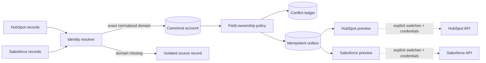

# RevOps Sync Control Plane

An auditable control plane for reconciling HubSpot and Salesforce account data without hiding identity decisions or pretending that a preview is a successful CRM sync.

The system normalizes exact domains, creates a canonical account, applies disclosed field-ownership policies, records every cross-CRM disagreement, and generates idempotent outbox payloads. Live writes are disabled by default and no delivery endpoint is exposed.

> The committed CRM fixture is entirely synthetic. This repository demonstrates software behavior—not customer data, campaign performance, pipeline, or revenue impact.

## Why this project exists

Naive two-way CRM syncs create loops and overwrite good data with stale data. The difficult parts are not HTTP requests; they are identity, ownership, replay safety, auditability, and knowing when **not** to merge.

This project makes those decisions inspectable:



## What is implemented

- conservative identity resolution using normalized exact domains
- explicit refusal to fuzzy-merge same-name records when a domain is unavailable
- deterministic canonical IDs and source-record checksums
- field ownership with preferred-source and latest-non-null fallback policies
- immutable conflict fingerprints, including both source values and the chosen resolution
- transactional reconciliation in PostgreSQL or SQLite
- idempotent HubSpot and Salesforce outbox previews
- guarded delivery client with retryable 429/5xx handling and `Retry-After` support
- FastAPI endpoints, optional API-key protection, OpenAPI, health/readiness, JSON logs, and Prometheus metrics
- Alembic migration, Docker Compose, GitHub Actions, and an 80% coverage gate
- a credential-ready BigQuery/dbt/Terraform path that is explicitly **not** represented as deployed

## Reproducible local run

Python 3.12+ is required.

```bash
python -m venv .venv
source .venv/bin/activate
python -m pip install -e ".[dev]"
cp .env.example .env
DATABASE_URL=sqlite:///./revops_sync.sqlite3 AUTO_CREATE_SCHEMA=true revops-sync reconcile
```

Start the API:

```bash
DATABASE_URL=sqlite:///./revops_sync.sqlite3 AUTO_CREATE_SCHEMA=true revops-sync serve
```

Then run reconciliation:

```bash
curl -s -X POST http://localhost:8000/v1/reconcile \
  -H 'content-type: application/json' \
  -d '{"source_mode":"fixture"}'
```

Inspect the canonical accounts and intended CRM actions:

```bash
curl -s http://localhost:8000/v1/accounts
curl -s http://localhost:8000/v1/outbox
```

For PostgreSQL and the containerized API:

```bash
docker compose up --build
```

## Identity policy

The automatic match rule is deliberately narrow:

1. remove scheme, path, port, trailing dot, and a leading `www.`;
2. lowercase the hostname;
3. merge only on an exact normalized domain;
4. when no valid domain exists, isolate by `provider + external_id`.

Two records named “Northstar Labs” with no domain therefore remain two canonical accounts. A human-reviewed merge workflow could be added later; the demo will not manufacture certainty.

## Field ownership

| Canonical field | Preferred source | Fallback |
|---|---|---|
| name | Salesforce | newest non-null observation |
| industry | Salesforce | newest non-null observation |
| employee count | Salesforce | newest non-null observation |
| account owner email | Salesforce | newest non-null observation |
| lifecycle stage | HubSpot | newest non-null observation |
| marketing opt-in | HubSpot | newest non-null observation |

Every divergent non-null pair is still written to the conflict ledger even when policy resolves it automatically.

## Verified synthetic run

The committed six-record fixture deterministically produces:

- 4 canonical accounts: two exact-domain matches and two isolated no-domain records
- 8 recorded field conflicts
- 8 preview-only outbox actions
- 0 external writes

Running the same input again creates no duplicate source, conflict, or outbox rows. These counts are fixture/software verification, not commercial metrics. See the dated [offline receipt](data/synthetic/offline_reconciliation_receipt_2026-08-27.json).

## API surface

- `POST /v1/reconcile` — reconcile fixture or caller-supplied records
- `GET /v1/accounts` — canonical account list
- `GET /v1/accounts/{id}` — sources, conflicts, and outbox history
- `GET /v1/outbox` — preview-only intended CRM operations
- `GET /v1/integrations/{provider}/accounts/{id}/preview` — provider-shaped request preview
- `GET /health/live`, `GET /health/ready`, `GET /metrics`

Set `WORKFLOW_API_KEY` to require `x-api-key` across the entire `/v1` surface. Leave it unset only for a local portfolio demonstration. Health and metrics endpoints remain outside that gate for infrastructure monitoring.

## Delivery safety

The public API contains no delivery route. The internal delivery client fails closed unless:

1. `LIVE_INTEGRATIONS_ENABLED=true`;
2. the provider-specific live switch is true;
3. the provider credential and endpoint are present;
4. application code explicitly invokes delivery.

Retries are bounded, use one idempotency key per intended state, and honor integer `Retry-After` values. The committed test uses an obviously fake token with an in-memory HTTP transport; it does not contact HubSpot or Salesforce.

## Verification

```bash
ruff check .
mypy src
pytest --cov=src/revops_sync --cov-report=term-missing --cov-fail-under=80
alembic upgrade head
alembic check
```

The local suite completed 15/15 tests with 87% statement coverage on 2026-08-27. GitHub Actions repeats lint, types, tests, a PostgreSQL migration/drift check, dbt parsing, Terraform validation, and a Docker build on every push.

## Honest boundaries

| Evidence | Classification | What it proves | What it does not prove |
|---|---|---|---|
| CRM fixture | synthetic | deterministic identity/conflict cases | access to private CRM data |
| offline receipt | measured on synthetic fixture | local orchestration and idempotency | a live cross-CRM sync |
| mocked retry test | simulated provider response | retry and idempotency behavior | provider uptime or API acceptance |
| integration previews | generated locally | request contracts and safety gates | successful HubSpot/Salesforce writes |
| BigQuery deployment pack | unexecuted infrastructure code | a reviewable deployment path | a live cloud warehouse |

No private credentials, customer records, delivery result, campaign result, pipeline, or revenue claim is committed.

## Documentation

- [Architecture](docs/ARCHITECTURE.md)
- [Conflict and integration contract](docs/INTEGRATIONS.md)
- [Portfolio case study](docs/CASE_STUDY.md)
- [BigQuery deployment path and blocker](docs/BIGQUERY_DEPLOYMENT.md)

## License

MIT
